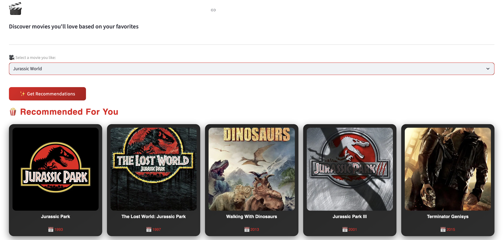
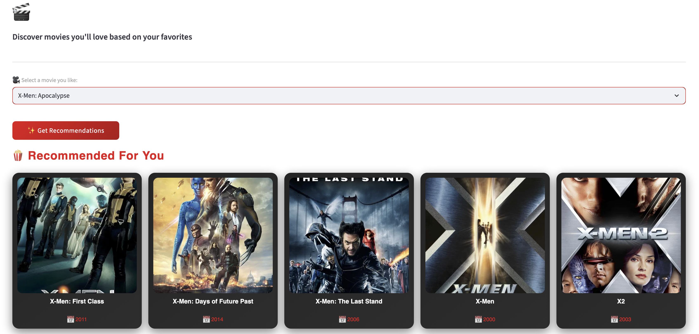

<div align="center">

# 🎬 CineMatch
### *Discover Your Next Favorite Film*

[](https://streamlit.io)
[](https://python.org)
[](https://huggingface.co/spaces/AbdullahKS-Devhub/movie-recommender)
[](https://themoviedb.org)

<br/>

> **Tell us one movie you love. We'll find five you'll obsess over.**

<br/>

🚀 **[Try the Live Demo →](https://huggingface.co/spaces/AbdullahKS-Devhub/movie-recommender)**

<br/>




</div>

---

## ✨ Features

- 🔍 **Smart Recommendations** — Content-based filtering using cosine similarity across 5000+ movies
- 🎨 **Netflix-inspired UI** — Dark theme with smooth hover animations and responsive layout
- 🖼️ **Live Movie Posters** — Fetched in real-time from the TMDB API using movie IDs
- 📅 **Release Years** — Displayed alongside every recommendation
- ⚡ **Instant Results** — Cached model loading for lightning-fast recommendations

---

## 🛠️ Tech Stack

| Layer | Technology |
|---|---|
| **Frontend** | Streamlit + Custom CSS |
| **ML Model** | Scikit-learn, Cosine Similarity |
| **Data** | TMDB 5000 Movies Dataset |
| **API** | The Movie Database (TMDB) |
| **Deployment** | Hugging Face Spaces |
| **Version Control** | Git + Git LFS |

---

## 🧠 How It Works
```
User selects a movie
        ↓
Extract feature vector from precomputed tags
        ↓
Compute cosine similarity against all 5000+ movies
        ↓
Return top 5 most similar movies
        ↓
Fetch posters + release years from TMDB API
        ↓
Display beautifully on screen
```

---

## 🚀 Run Locally

**1. Clone the repo**
```bash
git clone https://github.com/abdullahks-devhub/movie-recommendation-system.git
cd movie-recommendation-system
```

**2. Create a virtual environment**
```bash
python -m venv .venv
source .venv/bin/activate  # Mac/Linux
.venv\Scripts\activate     # Windows
```

**3. Install dependencies**
```bash
pip install -r requirements.txt
```

**4. Run the app**
```bash
streamlit run app.py
```

---

## 📁 Project Structure
```
movie-recommender-system/
│
├── app.py                  # Main Streamlit application
├── movies.pkl              # Preprocessed movie dataset
├── similarity.pkl          # Precomputed cosine similarity matrix
├── requirements.txt        # Python dependencies
└── README.md               # You are here
```

---

## 📊 Dataset

This project uses the **TMDB 5000 Movies Dataset** from Kaggle, which contains metadata for over 5,000 movies including cast, crew, genres, keywords, and overviews. These features are combined into tags and vectorized using **CountVectorizer**, then compared using **cosine similarity**.

---

## 🙌 Acknowledgements

- [TMDB](https://www.themoviedb.org/) for the movie metadata API
- [Kaggle](https://www.kaggle.com/) for the dataset
- [Streamlit](https://streamlit.io/) for making beautiful ML apps easy
- [Hugging Face](https://huggingface.co/) for free ML app hosting

---

<div align="center">

Made with ❤️ by **[Abdullah Khan](https://github.com/abdullahks-devhub)**

⭐ Star this repo if you found it useful!

</div>
